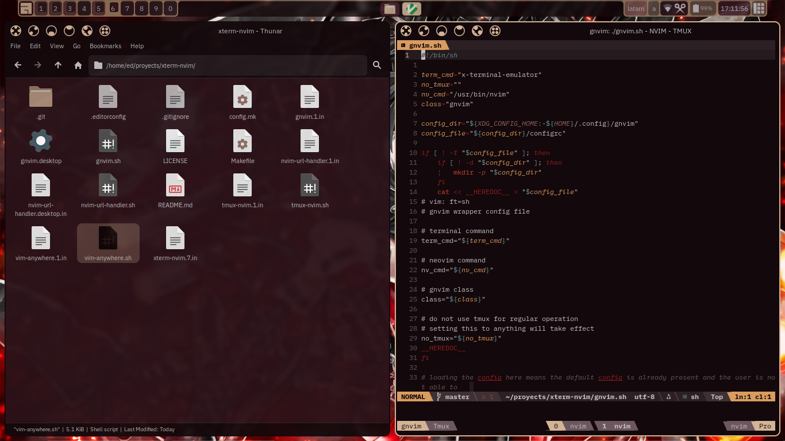

# xterm-nvim

A pair of shell wrappers with tmux to provide a sessioned "tabbed" (neo)vim client




## install

```sh
make install
```


## notes

### terminal wrapper

By default the script will use the `x-terminal-emulator` program, which is a debianism, usually a
symlink pointing to an appropriate wrapper script that does the work of normalizing the command line
to provide scripts an interface that is compatible with the common [xterm](https://manpages.debian.org/unstable/xterm/xterm.1.en.html)
parameter flags and behaviours for example the [gnome-terminal.wrapper](https://sources.debian.org/src/gnome-terminal/3.56.0-1/debian/gnome-terminal.wrapper/)
as such the `gnvim` script expects your terminal/wrapper to support the `-e` parameter to run
the `tmux-nvim` script.

Both scripts will generate a default config upon first run.

### vim-anywhere

Decided to roll out my own vim-anywhere implementation inspired on the original one with quite some
changes, for it to work your terminal emulator or wrapper must support the `-name` and `-T` flags
as by convenience with those you can set up rules in your window manager to to always treat the
terminal window as a floating window (if you use a tiling window manager) to be always on top, the
name and class passed onto the vim anywhere terminal is `GVim`
